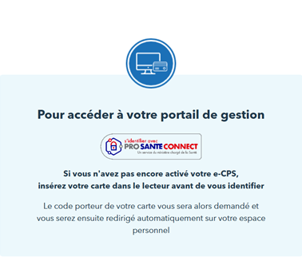
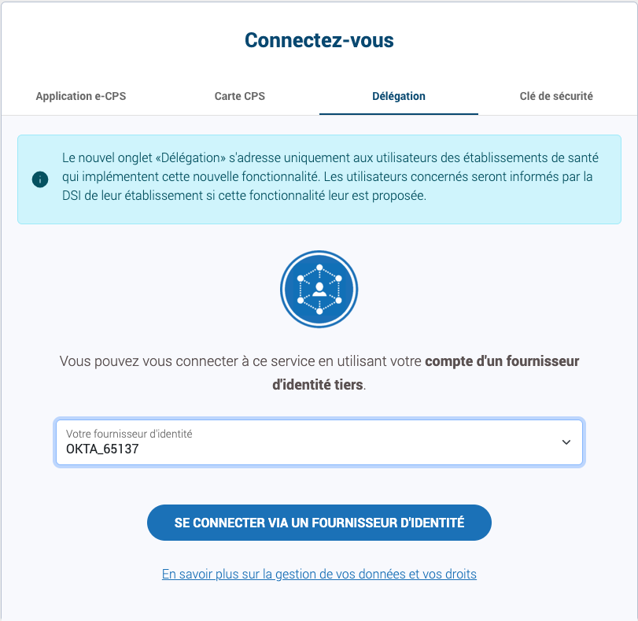
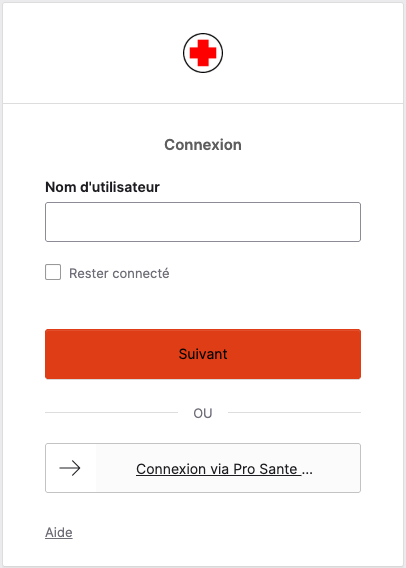
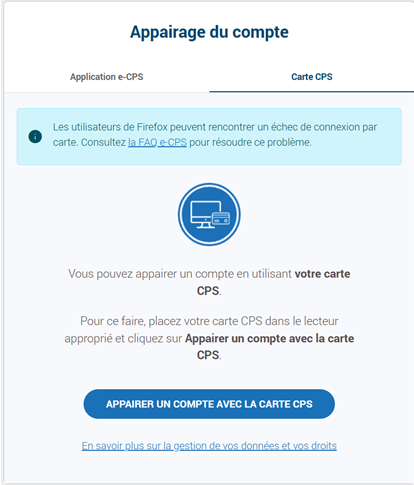

# Pro Santé connect sans couture avec Okta
Pro Santé Connect (PSC) est la solution nationale de fédération d’identités pour les professionnels des secteurs sanitaire, médico-social et social, inscrits au Répertoire Partagé des Professionnels de Santé (RPPS). Ce service socle est opéré par l’Agence du Numérique en Santé (ANS), en tant qu’autorité compétente en matière d’identité numérique de santé.

Au fil des déploiements, les retours du terrain ont mis en évidence la nécessité de faire évoluer PSC afin de simplifier et fluidifier l’accès aux services numériques qui y sont rattachés, en particulier dans le contexte des établissements de santé (ES).

Le projet Pro Santé Connect sans couture a donc pour ambition d’étudier, définir et mettre en œuvre des mesures organisationnelles et techniques permettant d’améliorer l’expérience utilisateur et de renforcer la continuité des parcours numériques au sein des ES.

Concrètement, pour faciliter la navigation et limiter les ruptures d’authentification, une [fédération ou délégation d’identité](./docs/10-SingleTenant-Model,md) peut être mise en place entre le fournisseur d’identités (FI) local de l’ES et PSC, selon les besoins et les contextes opérationnels.

Dans l'environnement de Bac à sable Pro Santé Connect, l’application de test PSC_BAS, c.à.d. le portail de gestion des utilisateurs Bac à sable est mise à disposition à cette fin ; elle est accessible à l’adresse Internet https://wallet.bas.psc.esante.gouv.fr/login-page.

Cette mise en oeuvre incluant le raccordement et la sécurisation avec Microsoft Entra ID a permis d'assoir la validité technique de la délégation à un fournisseur d'identité local proposée dans le cadre de PSC sans couture, et de recueillir des retours avec pour vocation de permettre de futures évolutions et améliorations de la solution proposée aujourd'hui.

La délégation de l’authentification à Microsoft Entra ID est décrite dans le Guide de configuration de Pro Santé Connect à destination des établissements de santé. Elle suppose une approbation préalable de l’application PSC_BAS dans le locataire Entra ID de l’ES retenu pour cette délégation.

Une fois celle-ci en place, en termes de parcours utilisateurs, lorsqu’un professionnel de Santé (PS) accède à ce service numérique (SN) depuis son navigateur, ce dernier est renvoyé vers PSC qui le redirige alors de façon transparente vers Microsoft Entra ID.

L’application de test permet de lancer cette cinématique en :

Cliquant sur le bouton S’identifier avec **PRO SANTE CONNECT.**

Sélectionnant **Okta** dans l’onglet **Délégation**

Cliquant sur le bouton **SE CONNECTER VIA UN FOURNISSEUR D’IDENTITE.**

## A la première connexion

Si le professionnel de santé (PS) n’a pas de session déjà ouverte avec Okta, il est invité à s’authentifier. Pour cela, il utilise un moyen d’identification électronique (MIE) conforme aux exigences de l’ANS et reconnu comme mécanisme d’authentification au sein de ce tenant.

L’activation des différents MIE, que l’ANS recommande aux établissements de santé d’évaluer, ainsi que leur prise en charge dans Okta, sont couvertes par la [solution](./MIE.md).

Une fois authentifié par Okta avec un MIE conforme, et le cas échéant via une session Windows ouverte permettant une navigation sans couture, le professionnel de santé (PS) est redirigé vers Pro Santé Connect (PSC).

Sur le plan technique, les redirections et échanges reposent sur le standard OpenID Connect (OIDC), en utilisant le flux de code d’autorisation (authorization code flow). Ce flux permet à l’application d’échanger un code d’autorisation contre des jetons d’ID représentant l’utilisateur authentifié, ainsi que des jetons d’accès nécessaires pour appeler des API protégées.

Lors d’une première authentification, le PS ne se voit pas accorder un accès direct au service numérique. Il est invité à procéder à un appairage entre le compte Okta attribué par son établissement et son identité forte via carte CPx ou e-CPS.

Si le professionnel de santé (PS) choisit de poursuivre en cliquant sur « APPAIRER UN COMPTE AVEC LA CARTE CPS », il est invité à utiliser sa carte CPx (ou, en alternative, l’application e-CPS via l’onglet dédié).

Une fois l’appairage effectué, l’écran d’appairage n’apparaît plus dans le parcours sans couture : il suffit alors uniquement de confirmer la validation de connexion.

**Note** sur le parcours sans couture

Il est préférable que le PS ne soit pas redirigé de façon totalement transparente vers le service numérique. Cette étape intermédiaire facilite la gestion des sessions et permet de mieux contrôler l’usage partagé des postes.

Exemple concret :
Un médecin en consultation externe utilise un poste partagé dans une salle de soins. Le poste est déjà ouvert par un infirmier avec son propre compte appairé.
Lorsque le médecin accède au service numérique, il choisit de ne pas utiliser le compte de l’infirmier et sélectionne une authentification PSC classique via sa carte e-CPS.
Après validation, il accède rapidement aux informations dont il a besoin pour la consultation, puis se déconnecte, sans impacter la session de l’infirmier.

## Authentification depuis l’ouverture de session d’un appareil Apple ou Microsoft

Avec [Okta Device Access](./docs/50-DeviceAccess-(optionnel).md), l’authentification qui se fait dès l’ouverture de session Mac OS ou Windows peut déjà répondre aux exigences du Référentiel d’Identification Électronique (RIE). Concrètement, cela veut dire que le professionnel de santé n’a plus besoin de retaper ses identifiants au moment d’accéder à un service numérique : une seule authentification forte, par exemple via sa carte CPx, suffit à lui donner un accès fluide à tout l’écosystème PSC.

Pour l’établissement, les bénéfices sont immédiats : l’expérience utilisateur est beaucoup plus simple, puisqu’on évite les écrans superflus, tout en gardant la confirmation de connexion côté PSC pour bien gérer les cas de postes partagés. C’est aussi un vrai gain en gouvernance, car la politique d’accès est centralisée dans Okta, ce qui facilite la conformité et les audits.

En pratique, cela permet d’allier sécurité et simplicité : les soignants gagnent du temps, les établissements gardent la maîtrise, et l’ensemble reste conforme aux exigences du RIE.
